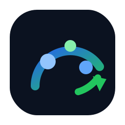
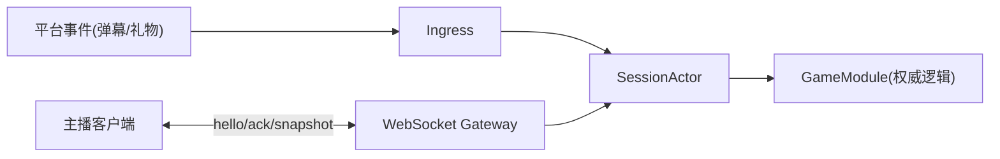

<p align="center">
  
</p>

<h1 align="center">Cohort</h1>

<p align="center">
  面向直播弹幕/礼物驱动的互动对战游戏框架（服务器权威 Tick + 状态快照）
</p>

<p align="center">
  <a href="https://github.com/cuihairu/Cohort/actions/workflows/ci.yml"></a>
  <a href="https://codecov.io/gh/cuihairu/Cohort"></a>
  <a href="https://github.com/cuihairu/Cohort/releases"></a>
  <a href="LICENSE"></a>
  
</p>

## 文档（VuePress）

- 站点（GitHub Pages）：`https://cuihairu.github.io/Cohort/`
- 源码：`docs/`
- 本地预览：`npm install && npm run docs:dev`
- 构建静态站：`npm run docs:build`（输出：`docs/.vuepress/dist`）

## 快速开始

```bash
dotnet run --project src/Cohort.Server
```

- HTTP：端口见 `src/Cohort.Server/Properties/launchSettings.json`（默认类似 `http://localhost:5083`）
- WS：`ws://localhost:<serverPort>/ws`
- 指标：`GET /sessions`

## 拆分模式（Gateway + EngineHost）

```bash
dotnet run --project src/Cohort.EngineHost
dotnet run --project src/Cohort.Gateway
```

- Gateway：对外提供 `/ws` 与 `/ingress/{platform}`
- EngineHost：运行权威 tick + 快照，通过本机 IPC 与 Gateway 通信（优先 UDS，失败降级 NamedPipe）

## 架构概览



## 技术栈与支持

- 语言：C#（随 .NET 9 默认 C# 版本）
- .NET：`net9.0`（见 `global.json`）
- 平台：Windows / Linux / macOS（服务器端），客户端以 WebSocket 协议接入

## 发布与 Tag

推荐使用语义化版本号打 tag：`v0.1.0`、`v0.1.1`。

```bash
git tag v0.1.0
git push origin v0.1.0
```

## 覆盖率

CI 会生成并上传覆盖率报告（见 Codecov badge / PR 检查）。
