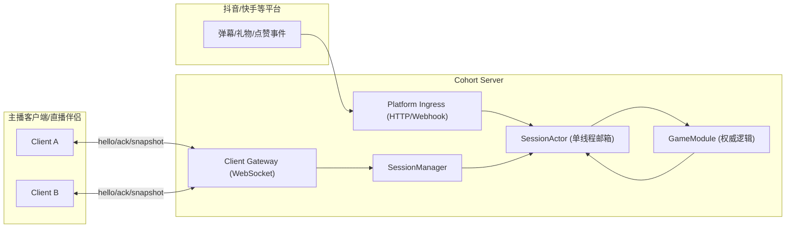

# 架构设计

## 总体组件

```mermaid
flowchart LR
  subgraph Platform["抖音/快手等平台"]
    P1["弹幕/礼物/点赞事件"]
  end

  subgraph Cohort["Cohort Server"]
    Ingress["Platform Ingress (HTTP/Webhook)"]
    GW["Client Gateway (WebSocket)"]
    SM["SessionManager"]
    SA["SessionActor (单线程邮箱)"]
    GM["GameModule (权威逻辑)"]
  end

  subgraph Clients["主播客户端/直播伴侣"]
    C1["Client A"]
    C2["Client B"]
  end

  P1 --> Ingress --> SA
  C1 <-->|hello/ack/snapshot| GW --> SM --> SA
  C2 <-->|hello/ack/snapshot| GW
  SA --> GM
  GM --> SA
```

## 核心原则（v1）

- 服务器权威：状态在服务器推进，客户端只“对齐+渲染”
- 不暂停服务器：慢端通过强制快照追赶，不拖累快端
- 有背压：每 tick 事件数上限 + 合并/降采样，避免“帧爆炸”

