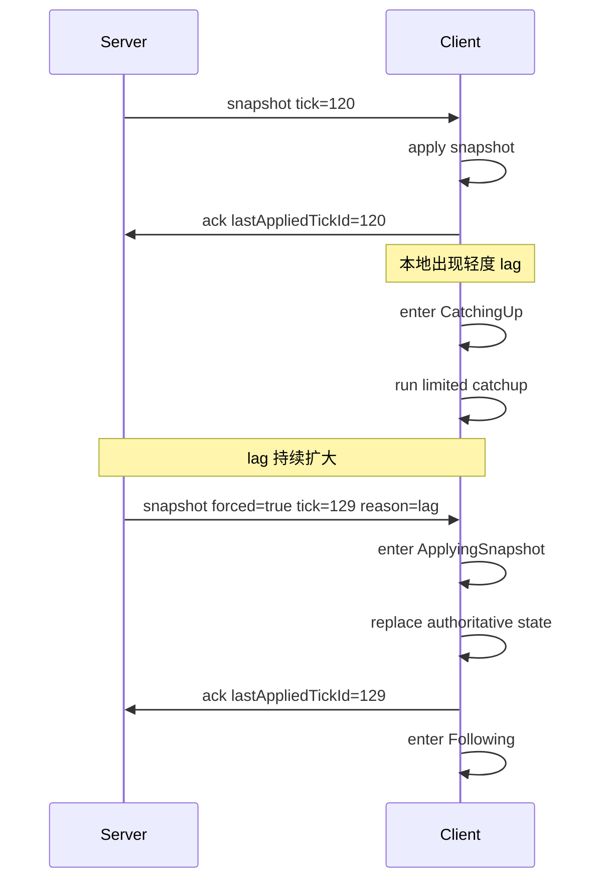

# 客户端追同步状态机

本文定义客户端如何围绕服务器权威 tick 进行收敛、追赶和重同步，目标是把“轻度追赶”和“重度恢复”拆开，避免无限补帧。

建议结合以下文档阅读：

- [帧同步设计](./frame-sync.md)
- [帧同步最佳实践](./frame-sync-best-practices.md)
- [参数调优](../reference/tuning.md)

## 设计目标

客户端状态机要解决四件事：

- 正常情况下稳定跟随服务器权威 tick
- 轻度落后时温和追赶，不打爆主线程
- 重度落后时快速切换到快照恢复
- 恢复后重新进入稳定跟随状态

## 核心原则

- 客户端不能自认为权威
- 客户端不能无限制补帧
- 客户端不能在重度落后时坚持回放所有历史
- 客户端 ACK 必须基于“已应用状态”，不能基于“已收到消息”

## 建议状态

建议把客户端同步过程拆成以下状态：

1. `Bootstrapping`
2. `Following`
3. `CatchingUp`
4. `ResyncRequired`
5. `ApplyingSnapshot`
6. `Degraded`

## 状态定义

### `Bootstrapping`

进入条件：

- 刚加入房间
- 刚重连
- 本地还没有可用权威状态

行为：

- 等待 `welcome`
- 建立 `tickDurationMs`、`inputDelayTicks` 等权威参数
- 等待首个可用快照

退出条件：

- 成功应用首个快照后，转入 `Following`

### `Following`

进入条件：

- 本地状态与服务器权威 tick 基本一致

行为：

- 正常按权威 tick 节奏推进
- 应用增量或周期快照
- 在状态真正应用完成后发送 `ack.lastAppliedTickId`

退出条件：

- 发现 `lagTicks` 超过轻度阈值，转入 `CatchingUp`
- 收到服务器强制快照，转入 `ApplyingSnapshot`
- 长时间未收到有效同步数据，转入 `ResyncRequired`

### `CatchingUp`

进入条件：

- 轻度落后

行为：

- 在受控上限内额外多跑少量逻辑 tick
- 保持渲染线程可用，不允许无限追赶
- 每帧或每秒都必须有追赶预算上限

建议限制：

- 每个渲染帧最多额外补 `1` 个逻辑 tick
- 每秒最多额外补 `5~10` 个逻辑 tick

退出条件：

- `lagTicks` 回到安全区，转入 `Following`
- `lagTicks` 继续扩大，转入 `ResyncRequired`
- 收到强制快照，转入 `ApplyingSnapshot`

### `ResyncRequired`

进入条件：

- `lagTicks` 超过重同步阈值
- `lastAckAgeMs` 持续过高
- 本地追赶无法在有限时间内收敛

行为：

- 停止继续扩大补帧预算
- 丢弃过旧的局部恢复计划
- 等待强制快照或主动请求最新快照

退出条件：

- 收到可用快照后，转入 `ApplyingSnapshot`

### `ApplyingSnapshot`

进入条件：

- 收到新的权威快照

行为：

- 原子替换本地逻辑状态到 `snapshot.tickId`
- 清理已过期增量
- 重建后续待应用窗口
- 状态真正完成后发送 ACK

关键要求：

- ACK 必须在状态应用完成后发送
- 不要在“开始处理快照”时就提前 ACK

退出条件：

- 状态切换完成后，转入 `Following`
- 如果快照应用失败，转入 `Degraded`

### `Degraded`

进入条件：

- 快照应用失败
- 本地状态损坏
- 同步组件进入异常状态

行为：

- 暂停正常同步推进
- 记录错误
- 等待重新初始化或完整重连

退出条件：

- 重新拿到初始化上下文和快照后，转入 `Bootstrapping`

## 推荐阈值

以下是一个实用的默认划分：

- 轻度追赶区间：`lagTicks <= 3~5`
- 强制重同步区间：`lagTicks > 5~10`
- ACK 超时告警：`lastAckAgeMs > 2 * tickDurationMs * maxLagTicks`

这不是固定标准，但适合作为初始值。

## 建议事件

状态机通常需要响应这些事件：

- `OnWelcomeReceived`
- `OnSnapshotReceived`
- `OnDeltaReceived`
- `OnRenderFrame`
- `OnAckTimeout`
- `OnLagEvaluated`
- `OnSnapshotApplyFailed`
- `OnReconnect`

其中最关键的是两个：

- `OnLagEvaluated`
- `OnSnapshotReceived`

前者决定是否继续追赶，后者决定是否直接切换恢复路径。

## 推荐转移关系

可以按下面的逻辑实现：

1. `Bootstrapping -> Following`
   条件：成功应用首个快照
2. `Following -> CatchingUp`
   条件：轻度 lag
3. `CatchingUp -> Following`
   条件：lag 收敛
4. `CatchingUp -> ResyncRequired`
   条件：lag 扩大或追赶预算耗尽
5. `Following -> ApplyingSnapshot`
   条件：收到强制快照
6. `ResyncRequired -> ApplyingSnapshot`
   条件：收到新快照
7. `ApplyingSnapshot -> Following`
   条件：快照应用成功
8. `ApplyingSnapshot -> Degraded`
   条件：快照应用失败
9. `Degraded -> Bootstrapping`
   条件：重新初始化

## 时序图

下面这张图描述了“客户端轻度落后后未能收敛，最终切换到强制快照恢复”的推荐流程：



这个流程里最关键的点有两个：

- 轻度 lag 先走有限追赶，不立即强制跳转
- 一旦判断无法收敛，直接切快照，不继续补完整历史

## 一个常见错误流程

下面这种实现很常见，也最容易出问题：

1. 客户端检测到落后
2. 开始在单帧里补很多逻辑帧
3. 补帧期间仍做完整渲染和完整表现计算
4. 主线程更卡
5. ACK 更慢
6. 服务器继续判定它更落后
7. 客户端继续加大追赶力度

这就是典型的恶性循环。

正确做法是：

- 轻度 lag 时只做受控追赶
- 超过阈值后立刻切换到快照恢复

## ACK 的正确语义

`ack.lastAppliedTickId` 表示：

- 客户端已经把该 tick 对应的权威状态真正应用完成

它不应该表示：

- 客户端已经收到该 tick 的数据
- 客户端已经把该消息放入队列
- 客户端计划稍后再应用

如果 ACK 发早了，服务器会误判客户端已经跟上，导致恢复策略失真。

## 渲染层建议

客户端逻辑切快照时，视觉上通常会出现跳变，因此建议表现层做这些补偿：

- 位置插值
- 血量和 UI 数值缓动
- 动画状态的柔性衔接
- 镜头平滑过渡

注意：

- 这些补偿只能在表现层做
- 不要让视觉层反过来影响逻辑层 ack 和 tick 判定

## 伪代码示意

```text
state = Bootstrapping

onSnapshot(snapshot):
  state = ApplyingSnapshot
  applyAuthoritativeState(snapshot)
  lastAppliedTick = snapshot.tickId
  sendAck(lastAppliedTick)
  state = Following

onUpdate():
  lag = serverTick - lastAppliedTick

  if state == Following and lag > catchupThreshold:
    state = CatchingUp

  if state == CatchingUp:
    runLimitedCatchup()
    if lag <= safeThreshold:
      state = Following
    else if lag > resyncThreshold:
      state = ResyncRequired

  if state == ResyncRequired:
    requestOrWaitSnapshot()
```

实现时可以更细，但不要改变核心原则：追赶有预算，恢复靠快照。

## 服务端配合要求

客户端状态机要稳定，服务端至少要满足以下条件：

- 持续推进权威 tick，不因为慢端暂停
- 能按客户端维度判断 `lagTicks`
- 能发送普通快照和强制快照
- 能通过 `resyncCooldownMs` 避免短时间反复打快照

当前项目里的 `SessionActor` 已具备这条主链路，因此客户端实现应围绕该行为收敛，而不是自行定义另一套恢复模型。

## 观测建议

客户端侧至少应该暴露这些指标：

- 当前状态机状态
- `lastAppliedTickId`
- `lastReceivedSnapshotTickId`
- 当前 `lagTicks`
- 每秒补追 tick 数
- 快照应用耗时
- 快照应用失败次数

如果要排查“为什么一直在追但追不上”，这些指标非常关键。

## 总结

客户端追同步状态机的本质，是把“轻微波动下的收敛”和“严重偏离后的恢复”分成两条路径。

稳定方案一般都满足这几点：

- 正常情况跟随权威 tick
- 轻度 lag 做有限追赶
- 重度 lag 直接吃快照
- ACK 只反映真实已应用状态

只要客户端还在试图“无限补帧把所有历史补完”，这个状态机就还不够健康。
